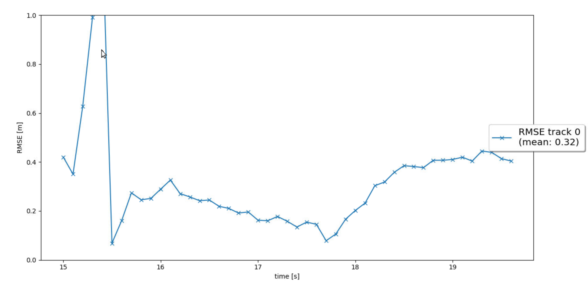
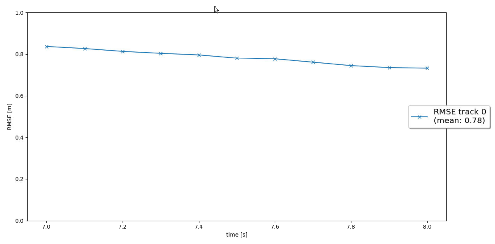
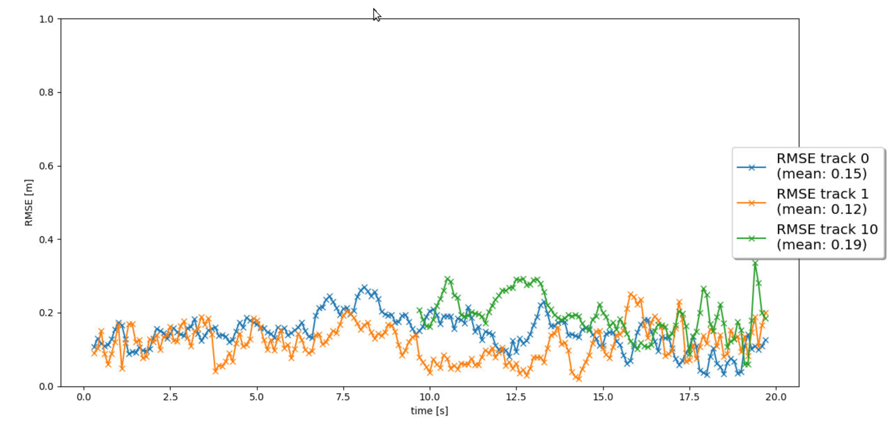
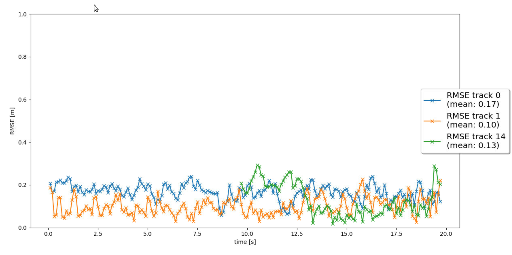

# Writeup: Track 3D-Objects Over Time
## Result
RMSE image for step 1

RMSE image for step 2

RMSE image for step 3

RMSE image for step 4

the final video is at here:
[img/my_tracking_results.avi](img/my_tracking_results.avi)

### 1. Write a short recap of the four tracking steps and what you implemented there (filter, track management, association, camera fusion). Which results did you achieve? Which part of the project was most difficult for you to complete, and why?
1. at [student/filter.py](student/filter.py)  
   Extended the Kalman filter to the 6-dimensional case, and implemented the ``predict`` and ``update`` functions of the Kalman filter.   
2. at [student/trackmanagement.py](student/trackmanagement.py)
   Management of car tracks, including initialization, addition and deletion of measurement-based tracks.
3. at [student/association.py](student/association.py)
   The association between tracks and measurements was completed according to Mahalanobis distance.
4. at [student/measurement.py](student/measurement.py)
   Finally, to implement sensor fusion, ``Measurement`` class, ``get_hx`` and ``in_fov`` function are done. We extended the sensor range from lidar only to lidar and camera to achieve sensor fusion.

The most difficult part is the association part. Need a lot of time to write the code, but the mathematical theory is not difficult. In addition, the most difficult part is the association of the code and data fusion pipeline.

### 2. Do you see any benefits in camera-lidar fusion compared to lidar-only tracking (in theory and in your concrete results)? 
Theoretically, the point cloud information of lidar and the image information of camera are obtained from different viewpoints, which can reduce the variance of information.   
Among the three tracks, the RMSE of step4 with data fusion for 2 tracks is lower than that of step3 without data fusion.

### 3. Which challenges will a sensor fusion system face in real-life scenarios? Did you see any of these challenges in the project?
Due to the algorithm of the trajectory management, there are inevitably permanent ``tentative`` vehicles, possibly due to data fusion problems or sensor failures. This is illustrated by a small orange square that can be seen in the second half of the video

### 4. Can you think of ways to improve your tracking results in the future?
1. Improve algorithms for track management
2. Use more and better sensors
