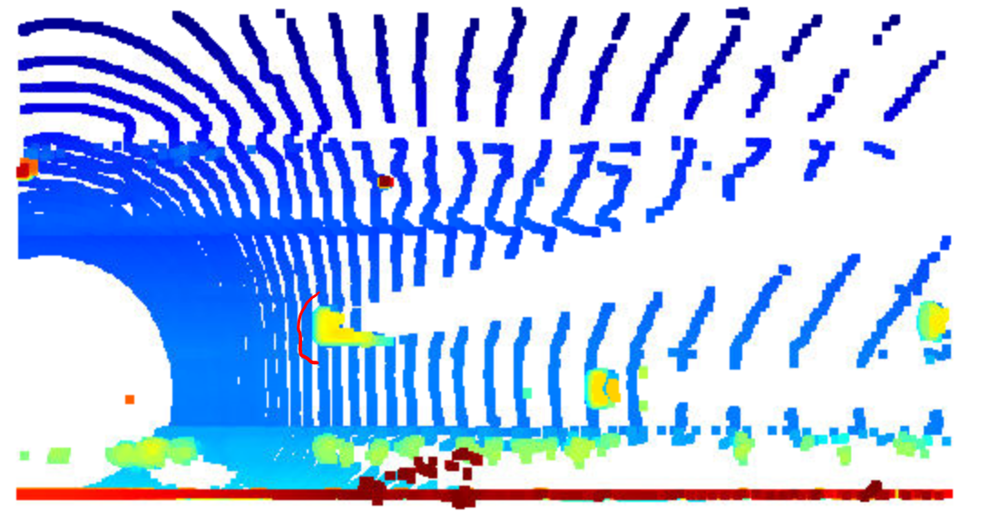
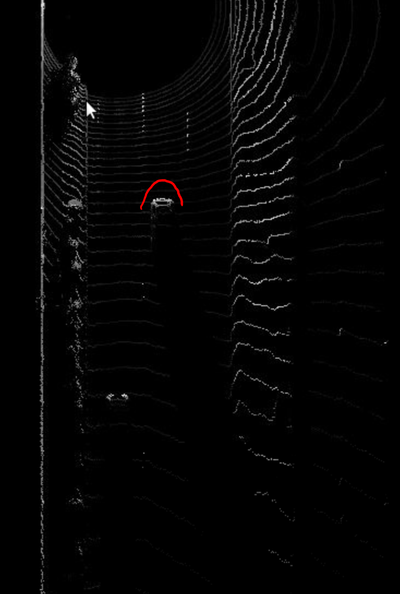

# report of midterm
## Find and display 10 examples of vehicles with varying degrees of visibility in the point-cloud.

## Identify vehicle features that appear as a stable feature on most vehicles (e.g. rear-bumper, tail-lights) and describe them briefly. Also, use the range image viewer from the last example to underpin your findings using the lidar intensity channel.

The bumper can be clearly identified in the point cloud and intensity map.

